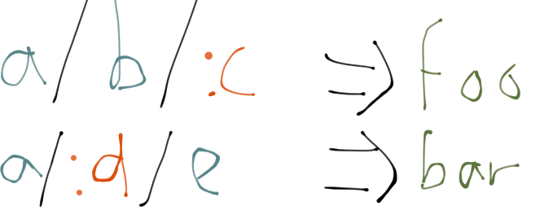

<h1 align="center">
param-trie<br>
<code>npm install param-trie</code><br>
<a href="https://travis-ci.org/quarterto/ParamTrie" id="status-image-popup">
  
</a>
</h1>

## What's a param trie?
It's like a trie but with holes that get filled in when you look up a result. So, given the map



we get the trie


and those red parameters get filled in when we look up:


## Usage

```javascript
var pt = require('param-trie');
var Param = pt.ParamBranch.Param,
    Branch = pt.ParamBranch.Branch;

var t = pt.ParamTrie.ofPath([
	Branch('a'),
	Branch('b'),
	Param('c')
], 'foo');

t.lookup(['a', 'b', 'x']); //⇒ [LookupResult(['foo']), Map { 'c': 'x' }]

var t2 = t.insertPath([
	Branch('a'),
	Param('d'),
	Branch('e')
], 'bar');

t.lookup(['a', 'x', 'e']); //⇒ [LookupResult(['bar']), Map { 'd': 'x' }]
```

## Api
### Creating a `ParamTrie`
#### The hard way: `ParamTrie` constructor
##### `new ParamTrie(values: Array, children: Map<ParamBranch, ParamTrie>)`

Takes an array of values and an [Immutable](https://github.com/facebook/immutable-js) Map of children. `ParamBranch` is a constructor with two children, `Param` and `Branch`, which denote whether the child is a parameter to be filled in or a concrete value.

#### For little tries: `empty` and `of`
##### `ParamTrie.empty(): ParamTrie<void>`
Returns a trie with no values and no children.

##### `ParamTrie.of<T>(x: T): ParamTrie<T>`
Returns a trie with the single value `x` and no children.

#### For narrow tries: `ofPath`
##### `ParamTrie.ofPath<T>(path: Array<ParamBranch>, value: T): ParamTrie<T>`

Creates a nested trie with the heirarchy as given by `path`. `ParamTrie.ofPath([], x)` is equivalent to `ParamTrie.of(x)`.

#### The easy way: `fromMap`
##### `ParamTrie.fromMap<T>(map: Map<Array<ParamBranch>, T>): ParamTrie<T>`

Given a map of paths to values, build an entire trie with the correct heirarchy.

### Methods
#### `ParamTrie<T>::merge(ParamTrie<T>): ParamTrie<T>`

Combines two tries. When paths collide, they're merged recursively. Values at the same path are concatenated.

#### `ParamTrie<T>::insertPath(path, value): ParamTrie<T>`

Special case of merge for a single path. Equivalent to `trie.merge(ParamTrie.ofPath(path, value))`.

#### `ParamTrie<T>::lookup(path: Array<String>): Array<LookupResult>`

Returns all of the matches of a particular path. Since multiple parameterised paths can match a given lookup path, `lookup` returns an array of results.

##### `LookupResult(value, params)`
A data type to encapsulate results from `lookup`. `value` is the array of values found at the path, and `params` is a map of parameters in the trie to values from the lookup path.

#### `ParamTrie<T>::indent(path: Array<ParamBranch>)`

Returns the trie nested under the path. `ParamTrie.ofPath(p, v)` is equivalent to `ParamTrie.of(v).indent(p)`.

## Licence
MIT.
